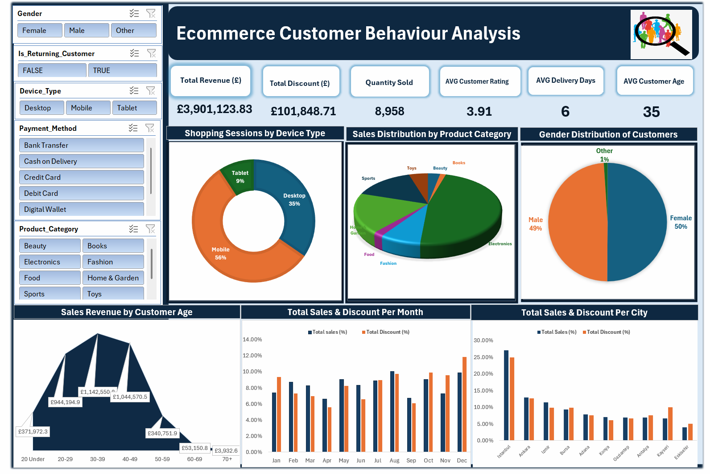

# Project 1 

**Title:** [Ecommerce Customer Behaviour Dashboard](https://github.com/IsraelAmogo/israelamogo.github.io/blob/main/ecommerce_customer_behavior_dashboard.xlsx)

**Tools Used:** Microsoft Excel (Slicers, Pivot Chart, Pivot Tables, Piecharts, Area line, Barchars)

**Project Description:**
This project focused on analysing customer behavioural data for an e-commerce company to uncover trends and patterns in sales performance during 2023. The objective was to deliver a comprehensive overview of key performance metrics through an interactive dashboard, enabling stakeholders to monitor and evaluate purchasing behaviours across multiple dimensions, including device type, payment method, product category, age group, and cities.
The dashboard provides:
1. Shopping Sessions by Device Type: Pie chart visualisation of sessions segmented by device type.
2. Sales Distribution by Product Category: Pie chart breakdown of total sales by category, highlighting product performance.
3. Customer Gender Distribution: Gender-based segmentation to support targeted product strategies.
4. Sales Revenue by Customer Age Group: Revenue analysis across age demographics, identifying high-value segments.
5. Monthly Sales vs. Discounts: Comparative view of sales and discounts across months to assess correlation.
6. City-Level Sales and Discounts: Bar chart analysis of regional performance, illustrating the impact of discounts on city-level sales.
  
The Interactive slicers further enhance usability, allowing stakeholders to filter data by gender, device type, payment method, and product category, enabling deeper exploration of customer behaviour and product performance.

**Key findings:**
1. Regional Performance: Certain cities consistently generate higher sales and discounts, revealing concentrated demand and opportunities for region-specific strategies.
2. Seasonal Trends: Sales and discounts peak in the final quarter, underscoring the importance of holiday-focused marketing campaigns.
3. Top-Performing Categories: Electronics, Home & Garden, Sports, and Fashion lead overall sales, while Food and Books contribute less, guiding inventory and promotional priorities.
4. Customer Demographics: Gender distribution is balanced (Female: 50%, Male: 49%). The average customer age is 35, with the 30–39 age group driving the highest revenue.
5. Device Usage: Mobile devices account for 56% of shopping sessions, highlighting the need for mobile optimisation and app-based engagement strategies.
6. Sales Volatility: Monthly fluctuations in sales reflect dynamic market behaviour, reinforcing the need for adaptive pricing and discount policies.

**Impact:**

This dashboard serves as a strategic decision-making tool for the management team, providing clear, actionable insights into customer behaviour, product performance, and regional trends. By consolidating complex data into an intuitive visual format, it empowers stakeholders to make evidence-based decisions, optimise marketing efforts, and refine operational strategies for sustained growth.

**Dashboard Overview:**

# Project 2

**Title:** Employee_Details Table: Data Manipulation and Interogation

**SQL Code:** [Employee_Details Sql code](https://github.com/IsraelAmogo/israelamogo.github.io/blob/main/Employee_Details.sql)

**SQL Skills Used:**

1. Data Retrieval (SELECT): Queried and extracted specific information from the database.
2. Data Aggregation (SUM, COUNT): Calculated totals, such as sales and quantities, and counted records to analyze data trends.
3. Data Filtering (WHERE, BETWEEN, IN, AND): Applied filters to select relevant data, including filtering by ranges and lists.
4. Data Source Specification (FROM): Specified the tables used as data sources for retrieval

**Project Description:**

This project involved designing and analysing the Employee_Details database table in SQL Server to manage and query organisational workforce information. The table was created to store essential employee attributes, enabling efficient data retrieval, reporting, and integration with other HR systems.

**Table Schema**
The dbo.Employee_Details table is an excel file and was imported to SQL server. It includes the following fields:
1. EmpId (float) – Unique identifier for each employee.
2. FullName (nvarchar(255)) – Employee’s full name.
3. ManagerId (float) – Identifier linking employees to their respective managers, supporting hierarchical reporting.
4. DateOfJoining (datetime) – Records the employee’s start date, useful for tenure analysis and workforce planning.
5. City (nvarchar(255)) – Captures the employee’s work location, enabling regional workforce distribution analysis.

**Technology used:** SQL server & Microsoft Excel

# Project 3

**Title:** Employee Information Database Analysis: Data Manipulation and Interogation

**SQL Code:** [Employee_Info_AND_Employee_Positions Tables](https://github.com/IsraelAmogo/israelamogo.github.io/blob/main/Employee_Info_AND_Employee_Positions.sql.sql)

**SQL Skills Used:**

1. Data Retrieval (SELECT) – Queried and extracted specific employee details such as names, addresses, and positions.
2. Data Aggregation (COUNT, GROUP BY) – Calculated department-wise employee counts, gender-based distributions, and salary ranges.
3. Data Filtering (WHERE, BETWEEN, IN, LIKE) – Applied filters to retrieve employees by department, salary range, joining date, and name patterns.
4. String Functions (UPPER, LEFT, CONCAT, CHARINDEX) – Manipulated text fields to format names, extract substrings, and combine columns.
5. Joins (INNER JOIN) – Linked employee details with position data to provide comprehensive workforce insights.
6. Sorting (ORDER BY, TOP) – Retrieved top salaries, ordered records by department and last name, and highlighted minimum/maximum values.
7. Table Creation & Duplication (SELECT INTO) – Created duplicate tables for testing and backup purposes.
8. Data Cleaning (DELETE WHERE IS NULL) – Removed incomplete records to maintain data integrity.

**Project Description:**

This project involved querying, manipulating and analysing the Employee_Info and Employee_Position table in SQL Server to manage and query organisational workforce data. The database was imported from Excel and structured to store essential employee attributes, enabling efficient reporting, workforce planning, and HR analytics.

The project focused on writing frequently asked SQL interview queries to demonstrate practical skills in data retrieval, filtering, aggregation, and transformation. Queries were designed to answer real-world HR and business questions, such as:

1. Identifying employees in specific departments (e.g., HR).
2. Analysing salary ranges and retrieving top earners.
3. Extracting substrings from employee names and addresses.
4. Generating department-wise employee counts.
5. Joining employee details with position data for richer insights.
6. Cleaning null values to ensure dataset quality.

**Table Schema**
The Employee_Info table was imported from Excel into SQL Server and includes:

1. EmpId (float) – Unique identifier for each employee.
2. FullName (nvarchar(255)) – Employee’s full name.
3. ManagerId (float) – Identifier linking employees to their respective managers.
4. DateOfJoining (datetime) – Records the employee’s start date.
5. City (nvarchar(255)) – Captures the employee’s work location.

Additional supporting tables such as Employee Position$ was used to store salary and role-related information.

**Technology used:** 

1. SQL Server Management Studio (SSMS)
2. SQL Server Database Engine
3. Excel (as source data)

# Project 4

**Title:** Football Players Dataset Analysis: Data Manipulation and Interogation

**SQL Code:** [Employee_Info_AND_Employee_Positions Tables](https://github.com/IsraelAmogo/israelamogo.github.io/blob/main/Employee_Info_AND_Employee_Positions.sql.sql)

**SQL Skills Used:**

1. Data Retrieval (SELECT) – Queried player details by team, position, age, and college.
2. Data Filtering (WHERE, BETWEEN, LIKE, IS NULL) – Retrieved subsets of players based on conditions such as rookies, missing ages, or specific height/weight ranges.
3. Data Cleaning (UPDATE, ALTER COLUMN) – Handled invalid values (e.g., replacing N/A in Age column) and enforced correct data types.
4. Data Aggregation (COUNT, AVG, GROUP BY) – Calculated averages (height, weight), team-wise player counts, and position percentages.
5. Ranking & Window Functions (RANK, PARTITION BY, OVER) – Ranked players by age and weight within teams, identified tallest/shortest players per position, and compared players against team averages.
6. Joins & Subqueries – Used subqueries and common table expressions (CTEs) to compare player attributes against team-level statistics.
7. Sorting (ORDER BY, TOP) – Retrieved top salaries, tallest players, and ordered results by multiple attributes.

**Project Description:**

This project involved analysing the Football Players Dataset in SQL Server to explore player demographics, physical attributes, and team composition. The dataset was imported from Excel and structured to support queries that answer practical sports analytics questions, such as identifying top performers, comparing players across teams, and evaluating positional distributions.

The project demonstrates proficiency in SQL querying, data cleaning, and analytical reporting, with queries designed to:

1. Retrieve players by team, position, or college.
2. Identify tallest, heaviest, and youngest players.
3. Calculate averages (height, weight) and compare players against team averages.
4. Rank players by age and weight within teams.
5. Analyse rookies and experience-level distributions.
6. Determine positional percentages across teams.
7. Clean and standardise data for accurate analysis.

**Table Schema**
The dbo.Football Players Data$ table includes:

1. Year (float) – Season year.
2. Team (nvarchar(255)) – Team name.
3. Name (nvarchar(255)) – Player’s full name.
4. No# (float) – Jersey number.
5. Pos (nvarchar(255)) – Playing position (e.g., WR, QB).
6. Ht (nvarchar(255)) – Height (feet/inches).
7. Wt (float) – Weight in pounds.
8. Age (int) – Player’s age.
9. Exp (nvarchar(255)) – Experience level (e.g., R for rookie).
10. College (nvarchar(255)) – College attended.
11. FirstName / LastName (nvarchar(255)) – Player’s name components.
12. Ft / In / Inches (float) – Height breakdown in feet, inches, and total inches.
13. NumGrp (nvarchar(255)) – Grouping attribute for jersey numbers.

**Technology used:** 

1. SQL Server Database Engine
2. Excel (as source data)

# Project 3 

**Title:** [HR Insights Dashboard](https://github.com/IsraelAmogo/israelamogo.github.io/blob/main/ecommerce_customer_behavior_dashboard.xlsx)

**Tools Used:** Power BI

**Project Description:** 

**Key findings:**

**Dashboard Overview:**

